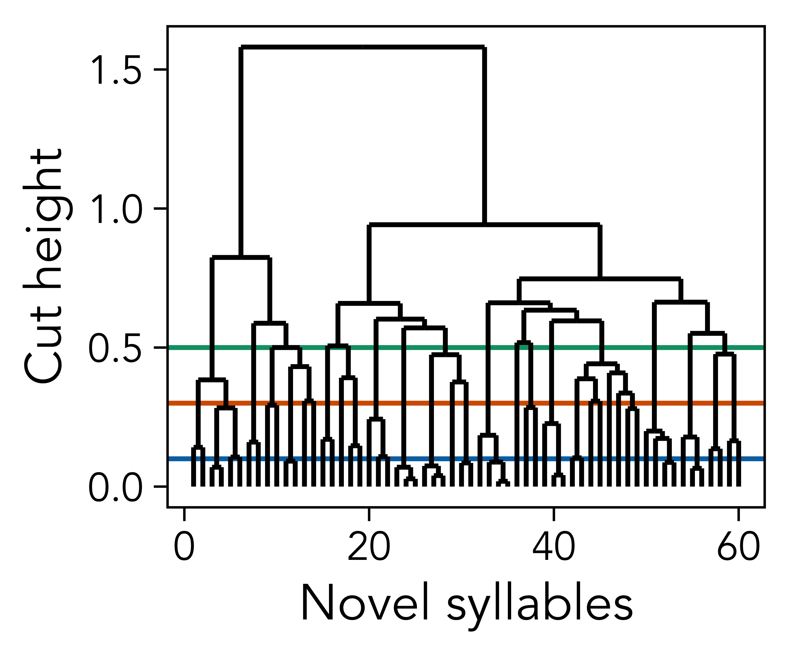

<!-- bibliography management done via (cmd+k to insert): https://gsverhoeven.github.io/post/zotero-rmarkdown-csl/ -->
<!-- github hosting done via: https://mbounthavong.com/blog/2022/7/30/hosting-a-r-markdown-html-file-on-a-github-page -->

```{r word-doc, echo = FALSE, eval = TRUE}
#if output is a word document
if(!knitr::is_html_output()){
  #hide all code
  knitr::opts_chunk$set(echo = FALSE)
  
  #set fonts of flextables
  flextable::set_flextable_defaults(font.family = "Garamond", font.size = 10, padding.top = 1, padding.bottom = 1, keep_with_next = TRUE)
}
```

```{css, echo = FALSE}
pre, code {white-space:pre !important; overflow-x:auto}

/* move code folding buttons to the left */
div.col-md-12 .pull-right {
  float: left !important
}
```

<br> © Science

# Links {.unnumbered}

- [Main text](https://masonyoungblood.github.io/zebra_finch_efficiency/)
- [PDF](https://github.com/masonyoungblood/zebra_finch_efficiency/blob/main/docs/Youngblood%20(2025)%20-%20Zebra%20finches%20transform%20random%20songs%20to%20exhibit%20linguistic%20laws.pdf)
<!-- - [PsyArXiv preprint](URL) -->
- [GitHub repository](https://github.com/masonyoungblood/zebra_finch_efficiency)

```{r, message = FALSE, warning = FALSE}
#load libraries
library(openxlsx)
library(brms)
library(ggplot2)
library(cowplot)
library(gtools)
library(rphylopic)
library(ggdendro)
library(cluster)
library(flextable)
library(dplyr)
library(ftExtra)
library(officer)

#set working directory
setwd("/Users/masonyoungblood/Documents/Work/Summer 2025/zebra_finch_efficiency/docs")
```

# Introduction

Efficiency in non-human communication systems is increasingly assessed using three linguistic laws found in human language [@james_etal21; @arnon_etal25; @youngblood24; @youngblood25]. Zipf's law of abbreviation and Menzerath's law, thought to reflect reduced production costs, predict that common items should be shorter and that longer sequences should be composed of shorter items, respectively [@menzerath54; @zipf49], while Zipf's rank-frequency law, thought to reflect learnability, predicts a power-law distributions of frequencies and ranks (i.e., first most common, second most common, etc.) [@zipf49]. It is unclear, however, how rapidly these patterns can emerge in communication systems. In this re-analysis of experimental data from James and Sakata [@james_sakata17], I assessed whether zebra finches tutored with random songs that have flat frequency distributions and fixed lengths transform them to exhibit language-like efficiency, measured using the three major linguistic laws described above.

# Results

James and Sakata [@james_sakata17] tutored juvenile male zebra finches with synthesized songs composed of five common syllable types found in wild zebra finch populations---denoted as "a" to "e"---separated by short silent gaps of around five ms. Each syllable type only appeared in each song once, leading to 120 possible song types (e.g., "abcde", "abced", etc.) that were completely neutral with respect to the three linguistic laws being assessed (see top row of Figure \@ref(fig:figure-distributions)).

```{r, echo = FALSE}
#load models
load("models/brev_model.RData")
load("models/brev_model_imp_lo.RData")
load("models/brev_model_imp_md.RData")
load("models/brev_model_imp_hi.RData")
load("models/menz_model.RData")
load("models/rank_freq_model.RData")
load("models/rank_freq_model_imp_lo.RData")
load("models/rank_freq_model_imp_md.RData")
load("models/rank_freq_model_imp_hi.RData")
```

After being tutored with these random songs, the zebra finches produced songs that exhibit patterns consistent with both Menzerath's law and Zipf's rank-frequency law---longer sequences are composed of shorter syllables (Est.: `r format(round(fixef(menz_model)[2, 1], 3), 3)`, 95% CI: `r format(round(fixef(menz_model)[2, 3], 3), 3)`---`r format(round(fixef(menz_model)[2, 4], 3), 3)`) (second column of Figure \@ref(fig:figure-distributions)), and the relationship between the ranks and frequency of syllable types fits a power-law with $R^2$ of `r format(round(bayes_R2(rank_freq_model)[1], 3), 3)` (95% CI: `r format(round(bayes_R2(rank_freq_model)[3], 3), 3)`---`r format(round(bayes_R2(rank_freq_model)[4], 3), 3)`) (third column of Figure \@ref(fig:figure-distributions)). There is only weak evidence for Zipf's law of abbreviation, with a negative but uncertain relationship between frequency and syllable duration (Est.: `r format(round(fixef(brev_model)[2, 1], 3), 3)`, 95% CI: `r format(round(fixef(brev_model)[2, 3], 3), 3)`---`r format(round(fixef(brev_model)[2, 4], 3), 3)`) (first column of Figure \@ref(fig:figure-distributions)). More details about the models can be seen in Table \@ref(tab:table-combined).

```{r figure-distributions, echo = FALSE, fig.align = "center", out.width = "100%", fig.cap = "Distributions for tutor songs (top) and learned songs (bottom), showing: syllable counts vs. durations (left), sequence lengths vs. syllable durations (middle), and syllable ranks vs. counts (right)."}
knitr::include_graphics("plots/distributions.png")
```

```{r table-combined, echo = FALSE, message = FALSE, warning = FALSE}
#format brevity table
brev_table <- cbind(fixef(brev_model), Rhat = rhat(brev_model, pars = c("b_Intercept", "b_scalefreq")))
brev_table <- format(round(brev_table, 3), 3)
rownames(brev_table) <- c("Intercept", "Frequency")
brev_table <- cbind("ZLA", rownames(brev_table), brev_table)
brev_table <- data.frame(brev_table)
brev_table <- brev_table[, -4]
colnames(brev_table) <- c("Model", "Param.", "Est.", "L-2.5%", "U-97.5%", "R-hat")

#format menzerath table
menz_table <- cbind(fixef(menz_model), Rhat = rhat(menz_model, pars = c("b_Intercept", "b_scalelen")))
menz_table <- format(round(menz_table, 3), 3)
rownames(menz_table) <- c("Intercept", "Seq. length")
menz_table <- cbind("ML", rownames(menz_table), menz_table)
menz_table <- data.frame(menz_table)
menz_table <- menz_table[, -4]
colnames(menz_table) <- c("Model", "Param.", "Est.", "L-2.5%", "U-97.5%", "R-hat")

#format rank-frequency table
rank_freq_table <- cbind(fixef(rank_freq_model), Rhat = rhat(rank_freq_model, pars = c("b_a_Intercept", "b_B_Intercept")))
rank_freq_table <- format(round(rank_freq_table, 3), 3)
rownames(rank_freq_table) <- c("\u03B1", "\u03B2")
rank_freq_table <- cbind("ZRFL", rownames(rank_freq_table), rank_freq_table)
rank_freq_table <- data.frame(rank_freq_table)
rank_freq_table <- rank_freq_table[, -4]
colnames(rank_freq_table) <- c("Model", "Param.", "Est.", "L-2.5%", "U-97.5%", "R-hat")

#print table
combined_table <- flextable(rbind(brev_table, menz_table, rank_freq_table)) %>% 
  theme_vanilla() %>% set_table_properties(layout = "autofit") %>%
  set_caption("Estimated parameter values from the models used to assess Zipf's law of abbreviation (ZLA), Menzerath's law (ML), and Zipf's rank-frequency law (ZRFL). L-2.5% and U-97.5% denote the lower and upper bounds of the 95% credible intervals. The R-hat values are all near 1, indicating that all models have converged.", autonum = run_autonum(seq_id = "tab", bkm = "table-combined")) %>%
  merge_v(j = "Model") %>%
  colformat_md()
combined_table
```

The main results for both of Zipf's laws, which make predictions about types, exclude the 30% of syllables that could not be assigned to the five common syllable types (i.e., "a"---"e") by James and Sakata [@james_sakata17]. Importantly, the results are qualitatively the same when novel syllables types are imputed by applying hierarchical clustering to their acoustic features, a standard approach in birdsong [@youngblood24] (see [Materials & Methods](#materials-methods)). For Zipf's law of abbreviation, the effect of frequency on syllable duration is `r format(round(fixef(brev_model_imp_lo)[2, 1], 3), 3)` (95% CI: `r format(round(fixef(brev_model_imp_lo)[2, 3], 3), 3)`---`r format(round(fixef(brev_model_imp_lo)[2, 4], 3), 3)`) at the highest granularity (lowest cut height), `r format(round(fixef(brev_model_imp_md)[2, 1], 3), 3)` (95% CI: `r format(round(fixef(brev_model_imp_md)[2, 3], 3), 3)`---`r format(round(fixef(brev_model_imp_md)[2, 4], 3), 3)`) at the middle granularity, and `r format(round(fixef(brev_model_imp_hi)[2, 1], 3), 3)` (95% CI: `r format(round(fixef(brev_model_imp_hi)[2, 3], 3), 3)`---`r format(round(fixef(brev_model_imp_hi)[2, 4], 3), 3)`) at the lowest granularity (highest cut height). The power-law also fits the rank-frequency distribution to a similar extent at all three granularities (highest: $R^2$ = `r format(round(bayes_R2(rank_freq_model_imp_lo)[1], 3), 3)`, middle: $R^2$ = `r format(round(bayes_R2(rank_freq_model_imp_md)[1], 3), 3)`, lowest: $R^2$ = `r format(round(bayes_R2(rank_freq_model_imp_hi)[1], 3), 3)`).

# Discussion

Zebra finches that are tutored with random songs transform them to exhibit both Menzerath's law and Zipf's rank-frequency law. The effect size for Menzerath's law, as well as the $R^2$ for Zipf's rank-frequency law, are squarely within the ranges observed in human language [@piantadosi14; @youngblood25]. However, there is only weak evidence for Zipf's law of abbreviation, which has a wide credible interval that overlaps zero and an effect size that only borders the weaker end of the range observed in human language [@youngblood25].

This discrepancy---strong support for only two of the three laws---suggests that they may have different origins. Menzerath's law, for example, may be primarily physical---a previous study found that experimentally-deafened zebra finches and canaries exhibit the law [@james_etal21], and it is stronger in spoken human language than it is in writing [@torre_etal19]. Zipf's law of abbreviation, on the other hand, may result from iterated social learning. The strength of the law increased over iterations in an artificial language experiment [@kanwal_etal17], and recent modeling work suggests that pressure for brevity over many rounds of social learning can produce it [@morin_koshevoy25]. Another study showed that when zebra finches raised in isolation act as the "seeds" for new song lineages, the duration of some syllable types decreases over several generations [@feher_etal09]. That being said, Zipf's rank-frequency law is also linked to social learning---in that it is thought to enhance learnability [@arnon_etal25] and increased over iterations in an artificial language experiment [@arnon_kirby24]---and yet it appears alongside Menzerath's law. Future studies could use iterated learning studies to illuminate the origins of these three linguistic laws in non-human animal communication.

# Materials & Methods {#materials-methods}

The data analyzed in this study were collected by James and Sakata [@james_sakata17] for an experiment on how learning biases impact vocal sequencing. Juvenile male zebra finches (n = 51) were raised with their fathers for up to five days post hatch (dph), and then with their mother or a foster mother until reaching nutritional independence (\~35-50 dph). At that point, the juveniles were housed individually and tutored with synthesized songs for at least 30 days. After tutoring, James and Sakata [@james_sakata17] recorded and analyzed spontaneously produced songs with stereotyped motifs (n = 45 songs, containing a total of n = 200 syllables).

```{r}
#load data
data <- read.xlsx("data/james_sakata_2017.xlsx")
```

James and Sakata [@james_sakata17] found that 30% of syllables were novel and did not appear in the tutor songs. The main analysis excludes these novel syllables, but I conducted supplementary analyses to ensure that their exclusion did not impact the main conclusions. To impute types for these novel syllables, I applied Ward's hierarchical clustering algorithm to four features---the identity of the singer, the duration, the mean frequency, and the mean amplitude---using Gower's distance to account for the inclusion of both categorical (singer identity) and continuous variables. Then, I used three cut heights to generate clusters at three levels of granularity for downstream analysis: 0.1 (low), 0.3 (medium), and 0.5 (high) (see Figure \@ref(fig:figure-cut-heights)).

```{r, eval = FALSE}
#apply hierarchical clustering to features of novel syllables, alongside identity of birds
clust_feats <- scale(data[which(data$SyllableID == "n"), 5:7])
clust_feats <- cbind(data.frame(clust_feats), factor(data[which(data$SyllableID == "n"), ]$BirdID))
dist_mat <- daisy(clust_feats, metric = "gower")
heir_clust <- hclust(dist_mat, method = "ward.D2")
dendro <- dendro_data(heir_clust, type = "rectangle")

#get clusters at cut heights and add to data
clust <- data.frame(cutree(heir_clust, h = c(0.1, 0.3, 0.5)))
clust[, 1] <- as.character(clust[, 1])
clust[, 2] <- as.character(clust[, 2])
clust[, 3] <- as.character(clust[, 3])
data$syl_id_imp_lo <- data$SyllableID
data$syl_id_imp_md <- data$SyllableID
data$syl_id_imp_hi <- data$SyllableID
data$syl_id_imp_lo[which(data$SyllableID == "n")] <- clust[, 1]
data$syl_id_imp_md[which(data$SyllableID == "n")] <- clust[, 2]
data$syl_id_imp_hi[which(data$SyllableID == "n")] <- clust[, 3]
```

```{r, eval = FALSE}
#check cut heights
png("plots/cut_heights.png", width = 2.4, height = 2, units = "in", res = 1200)
ggplot(segment(dendro)) + 
  geom_hline(yintercept = 0.1, color = "#0072B2") + 
  geom_hline(yintercept = 0.3, color = "#D55E00") + 
  geom_hline(yintercept = 0.5, color = "#009E73") + 
  geom_segment(aes(x = x, y = y, xend = xend, yend = yend)) +
  xlab("Clusters") + 
  ylab("Cut height") + 
  theme_linedraw(base_family = "Avenir") + 
  theme(panel.grid.major = element_blank(), panel.grid.minor = element_blank())
dev.off()
```

```{r figure-cut-heights, echo = FALSE, fig.align = "center", out.width = "30%", fig.cap = "The results of hierarchical clustering applied to the singer identity and acoustic features of the novel syllables, with the three cut heights used to identify clusters."}

```

```{r, eval = FALSE}
#add sequence id
seq_id <- c(1)
seq <- 1
for(i in 2:nrow(data)){
  if(data$Position[i - 1] == "end"){
    seq <- seq + 1
  }
  seq_id <- c(seq_id, seq)
}
data$seq_id <- seq_id

#reformat and un-log duration
data <- data[, c(1, 11, 3, 4, 8, 9, 10, 6)]
colnames(data) <- c("ind", "seq_id", "pos", "syl_id", "syl_id_imp_lo", "syl_id_imp_md", "syl_id_imp_hi", "dur")
data$dur <- 10^(data$dur)

#store median syllable durations
syl_durs <- c(
  round(median(data$dur[which(data$syl_id == "a")])),
  round(median(data$dur[which(data$syl_id == "b")])),
  round(median(data$dur[which(data$syl_id == "c")])),
  round(median(data$dur[which(data$syl_id == "d")])),
  round(median(data$dur[which(data$syl_id == "e")]))
)

#get permuted sequences as per james and sakata 2017
rand_seqs <- permutations(n = 5, r = 5, v = 1:5)
rand_seqs <- unlist(lapply(1:120, function(x){rand_seqs[x, ]}))

#combine into data frame matching real data
rand_data <- data.frame(
  ind = NA, 
  seq_id = rep(1:120, each = 5), 
  pos = rep(1:5, 120), 
  syl_id = c("a", "b", "c", "d", "e")[rand_seqs], 
  dur = syl_durs[rand_seqs],
  freq = 120,
  len = 5
)
rand_data$freq <- rand_data$freq/sum(rand_data$freq)

#add frequencies and ranks of syllables
freqs <- data.frame(table(data$syl_id))
colnames(freqs) <- c("syl_id", "freq")
freqs$rank <- c(6-rank(freqs$freq[1:5]), NA)
freqs$freq[6] <- NA
freqs$freq <- freqs$freq/sum(freqs$freq, na.rm = TRUE)
data$freq <- freqs$freq[match(data$syl_id, freqs$syl_id)]
data$freq[which(data$syl_id == "n")] <- NA
data$rank <- freqs$rank[match(data$syl_id, freqs$syl_id)]

#add frequencies and ranks of imputed syllables
freqs_imp_lo <- data.frame(table(data$syl_id_imp_lo))
freqs_imp_md <- data.frame(table(data$syl_id_imp_md))
freqs_imp_hi <- data.frame(table(data$syl_id_imp_hi))
colnames(freqs_imp_lo) <- c("syl_id", "freq")
colnames(freqs_imp_md) <- c("syl_id", "freq")
colnames(freqs_imp_hi) <- c("syl_id", "freq")
freqs_imp_lo$rank <- nrow(freqs_imp_lo)+1-rank(freqs_imp_lo$freq, ties.method = "first")
freqs_imp_md$rank <- nrow(freqs_imp_md)+1-rank(freqs_imp_md$freq, ties.method = "first")
freqs_imp_hi$rank <- nrow(freqs_imp_hi)+1-rank(freqs_imp_hi$freq, ties.method = "first")
freqs_imp_lo$freq <- freqs_imp_lo$freq/sum(freqs_imp_lo$freq)
freqs_imp_md$freq <- freqs_imp_md$freq/sum(freqs_imp_md$freq)
freqs_imp_hi$freq <- freqs_imp_hi$freq/sum(freqs_imp_hi$freq)
data$freq_imp_lo <- freqs_imp_lo$freq[match(data$syl_id_imp_lo, freqs_imp_lo$syl_id)]
data$freq_imp_md <- freqs_imp_md$freq[match(data$syl_id_imp_md, freqs_imp_md$syl_id)]
data$freq_imp_hi <- freqs_imp_hi$freq[match(data$syl_id_imp_hi, freqs_imp_hi$syl_id)]
data$rank_imp_lo <- freqs_imp_lo$rank[match(data$syl_id_imp_lo, freqs_imp_lo$syl_id)]
data$rank_imp_md <- freqs_imp_md$rank[match(data$syl_id_imp_md, freqs_imp_md$syl_id)]
data$rank_imp_hi <- freqs_imp_hi$rank[match(data$syl_id_imp_hi, freqs_imp_hi$syl_id)]

#add lengths of sequences (to both datasets)
lens <- data.frame(table(data$seq_id))
colnames(lens) <- c("seq_id", "len")
data$len <- lens$len[match(data$seq_id, lens$seq_id)]
```

Bayesian statistical modeling was conducted in Stan using the brms package in R, using slight modifications of the specifications from Youngblood [@youngblood24; @youngblood25]. All models were run for 100,000 iterations across 10 chains of Markov chain Monte Carlo with z-scored variables. Zipf's law of abbreviation was assessed with a lognormal model with syllable duration as the outcome variable and frequency as the predictor variable. Menzerath's law was assessed with a lognormal model with syllable duration as the outcome variable and sequence length as the predictor variable. Both of these models included the same three varying intercepts---sequence nested within individual, and syllable type---as well as the same priors---Gaussian distributions with $\mu = 0$ and $\sigma = 1$ for the intercepts, effects, and $\sigma$s of the posteriors and error distributions (with lower bounds of 0 for the $\sigma$s). Zipf's rank-frequency law was assessed with a nonlinear model based on Mandelbrot's generalization [@piantadosi14]: $\text{frequency} = 1/(\text{rank} - \beta)^\alpha$. The priors for the rank-frequency model were a Gaussian distribution with $\mu = 1$, $\sigma = 1$, and a lower bound of 1 for $\alpha$, a Gaussian distribution with $\mu = 2.7$, $\sigma = 1$, and a lower bound of -1 for $\beta$, and a Gaussian distribution with $\mu = 0$, $\sigma = 1$, and a lower bound of 0 for the $\sigma$ of the error distribution [@izsak06; @piantadosi14].

```{r, eval = FALSE}
#set priors for zipf's brevity and menzerath's laws
brev_menz_prior <- prior(normal(0, 1), class = "Intercept") + 
  prior(normal(0, 1), class = "b") + 
  prior(normal(0, 1), lb = 0, class = "sd") + 
  prior(normal(0, 1), lb = 0, class = "sigma")

#run model of zipf's brevity law
brev_model <- brm(scale(log(dur)) ~ scale(freq) + (1|ind/seq_id) + (1|syl_id),
                  data[which(data$syl_id != "n"), ], prior = brev_menz_prior,
                  chains = 10, iter = 10000, cores = 10, seed = 12345)
save(brev_model, file = "models/brev_model.RData")

#run model of zipf's brevity law on imputed clusters
brev_model_imp_lo <- brm(scale(log(dur)) ~ scale(freq_imp_lo) + (1|ind/seq_id) + (1|syl_id_imp_lo),
                         data, prior = brev_menz_prior,
                         chains = 10, iter = 10000, cores = 10, seed = 12345)
brev_model_imp_md <- brm(scale(log(dur)) ~ scale(freq_imp_md) + (1|ind/seq_id) + (1|syl_id_imp_md),
                         data, prior = brev_menz_prior,
                         chains = 10, iter = 10000, cores = 10, seed = 12345)
brev_model_imp_hi <- brm(scale(log(dur)) ~ scale(freq_imp_hi) + (1|ind/seq_id) + (1|syl_id_imp_hi),
                         data, prior = brev_menz_prior,
                         chains = 10, iter = 10000, cores = 10, seed = 12345)
save(brev_model_imp_lo, file = "models/brev_model_imp_lo.RData")
save(brev_model_imp_md, file = "models/brev_model_imp_md.RData")
save(brev_model_imp_hi, file = "models/brev_model_imp_hi.RData")

#run model of menzerath's law
menz_model <- brm(scale(log(dur)) ~ scale(len) + (1|ind/seq_id) + (1|syl_id),
                  data, prior = brev_menz_prior,
                  chains = 10, iter = 10000, cores = 10, seed = 12345)
save(menz_model, file = "models/menz_model.RData")

#set priors for zipf's rank-frequency law
#means from 10.3758/s13423-014-0585-6
#lower bounds from 10.1007/s11192-006-0052-x
rank_freq_prior <- prior(normal(1, 1), lb = 1, nlpar = "a") + 
  prior(normal(2.7, 1), lb = -1, nlpar = "B") + 
  prior(normal(0, 1), lb = 0, class = "sigma")

#run model of zipf's rank-frequency law
rank_freq_model <- brm(bf(freq ~ 1/((rank + B)^a), a + B ~ 1, nl = TRUE),
                       unique(data[, which(colnames(data) %in% c("freq", "rank"))])[-6, ],
                       prior = rank_freq_prior,
                       chains = 10, iter = 10000, cores = 10, seed = 12345)
save(rank_freq_model, file = "models/rank_freq_model.RData")

#run model of zipf's rank-frequency law on imputed clusters
rank_freq_model_imp_lo <- brm(bf(freq_imp_lo ~ 1/((rank_imp_lo + B)^a), a + B ~ 1, nl = TRUE),
                              unique(data[, which(colnames(data) %in% c("freq_imp_lo", "rank_imp_lo"))]),
                              prior = rank_freq_prior,
                              chains = 10, iter = 10000, cores = 10, seed = 12345)
rank_freq_model_imp_md <- brm(bf(freq_imp_md ~ 1/((rank_imp_md + B)^a), a + B ~ 1, nl = TRUE),
                              unique(data[, which(colnames(data) %in% c("freq_imp_md", "rank_imp_md"))]),
                              prior = rank_freq_prior,
                              chains = 10, iter = 10000, cores = 10, seed = 12345)
rank_freq_model_imp_hi <- brm(bf(freq_imp_hi ~ 1/((rank_imp_hi + B)^a), a + B ~ 1, nl = TRUE),
                              unique(data[, which(colnames(data) %in% c("freq_imp_hi", "rank_imp_hi"))]),
                              prior = rank_freq_prior,
                              chains = 10, iter = 10000, cores = 10, seed = 12345)
save(rank_freq_model_imp_lo, file = "models/rank_freq_model_imp_lo.RData")
save(rank_freq_model_imp_md, file = "models/rank_freq_model_imp_md.RData")
save(rank_freq_model_imp_hi, file = "models/rank_freq_model_imp_hi.RData")
```

```{r, eval = FALSE}
#get best fit data for brevity
freq_vals <- seq(round(min(data[which(data$syl_id != "n"), ]$freq), 3), round(max(data[which(data$syl_id != "n"), ]$freq), 3), 0.001)
dur_vals_scaled <- fitted(brev_model, data.frame(freq = freq_vals), re_formula = NA, summary = TRUE)
dur_vals <- exp(dur_vals_scaled*sd(log(data[which(data$syl_id != "n"), ]$dur)) + mean(log(data[which(data$syl_id != "n"), ]$dur)))
brev_fit <- data.frame(dur = dur_vals[, 1], freq = freq_vals, low = dur_vals[, 3], upp = dur_vals[, 4])

#plot brevity (on both datasets)
brev_plot <- ggplot() + 
  geom_ribbon(data = brev_fit, aes(x = freq, ymin = low, ymax = upp), fill = "#0072B2", alpha = 0.2) + 
  geom_point(data = data[which(data$syl_id != "n"), ], aes(x = freq, y = dur), color = "#0072B2") + 
  geom_line(data = brev_fit, aes(x = freq, y = dur), color = "#0072B2") +
  ylab("Syllable duration (ms)") + 
  xlab("Frequency") + 
  coord_cartesian(ylim = c(25, 205)) + 
  theme_linedraw(base_family = "Avenir") + 
  theme(axis.text.y = element_text(angle = 90, hjust = 1))
rand_brev_plot <- ggplot() + 
  geom_jitter(data = rand_data, aes(x = freq, y = dur), color = "#0072B2", width = 0.00005, height = 3) + 
  geom_vline(xintercept = rand_data$freq[1], color = "#0072B2") + 
  ylab("Syllable duration (ms)") + 
  xlab("Frequency") + 
  coord_cartesian(xlim = c(0, 0.0032), ylim = c(25, 170)) + 
  theme_linedraw(base_family = "Avenir") + 
  theme(axis.text.y = element_text(angle = 90, hjust = 1))

#get best fit data for menzerath
len_vals <- seq(round(min(data$len), 1), round(max(data$len), 1), 0.1)
dur_vals_scaled <- fitted(menz_model, data.frame(len = len_vals), re_formula = NA, summary = TRUE)
dur_vals <- exp(dur_vals_scaled*sd(log(data[which(data$syl_id != "n"), ]$dur)) + mean(log(data[which(data$syl_id != "n"), ]$dur)))
menz_fit <- data.frame(dur = dur_vals[, 1], len = len_vals, low = dur_vals[, 3], upp = dur_vals[, 4])

#plot menzerath (on both datasets)
menz_plot <- ggplot() + 
  geom_ribbon(data = menz_fit, aes(x = len, ymin = low, ymax = upp), fill = "#D55E00", alpha = 0.2) + 
  geom_point(data = data, aes(x = len, y = dur), color = "#D55E00") + 
  geom_line(data = menz_fit, aes(x = len, y = dur), color = "#D55E00") +
  xlab("Sequence length") + 
  ylab("Syllable duration (ms)") + 
  theme_linedraw(base_family = "Avenir") + 
  theme(axis.text.y = element_text(angle = 90, hjust = 1))
rand_menz_plot <- ggplot() + 
  geom_jitter(data = rand_data, aes(x = len, y = dur), color = "#D55E00", width = 0.1, height = 3) + 
  geom_vline(xintercept = 5, color = "#D55E00") + 
  xlab("Sequence length") + 
  ylab("Syllable duration (ms)") + 
  xlim(2, 8) + 
  theme_linedraw(base_family = "Avenir") + 
  theme(axis.text.y = element_text(angle = 90, hjust = 1))

#get best fit for rank-frequency law
rank_vals <- seq(1, 5, 0.1)
freq_vals <- fitted(rank_freq_model, data.frame(rank = rank_vals))
rank_freq_fit <- data.frame(freq = freq_vals[, 1], rank = rank_vals, low = freq_vals[, 3], upp = freq_vals[, 4])
rand_rank_freq_data <- data.frame(freq = 120, rank = 1:5)
rand_rank_freq_data$freq <- rand_rank_freq_data$freq/sum(rand_rank_freq_data$freq)

#plot rank-frequency
rank_freq_plot <- ggplot() + 
  geom_ribbon(data = rank_freq_fit, aes(x = rank, ymin = low, ymax = upp), fill = "#009E73", alpha = 0.2) + 
  geom_point(data = unique(data[, which(colnames(data) %in% c("freq", "rank"))])[-6, ], aes(x = rank, y = freq), color = "#009E73") + 
  geom_line(data = rank_freq_fit, aes(x = rank, y = freq), color = "#009E73") +
  xlab("Rank") + 
  ylab("Frequency") + 
  scale_x_log10() + 
  scale_y_log10() + 
  theme_linedraw(base_family = "Avenir") + 
  theme(axis.text.y = element_text(angle = 90, hjust = 1))
rand_rank_freq_plot <- ggplot() + 
  geom_point(data = rand_rank_freq_data, aes(x = rank, y = freq), color = "#009E73") + 
  geom_hline(yintercept = rand_rank_freq_data$freq[1], color = "#009E73") + 
  xlab("Rank") + 
  ylab("Frequency") + 
  scale_x_log10() + 
  scale_y_log10() + 
  coord_cartesian(ylim = c(0.03, 1)) + 
  theme_linedraw(base_family = "Avenir") + 
  theme(axis.text.y = element_text(angle = 90, hjust = 1))

#create top and bottom rows
top_row <- plot_grid(rand_brev_plot, rand_menz_plot, rand_rank_freq_plot, nrow = 1, labels = c("a", "b", "c"), label_fontfamily = "Avenir Next", label_fontface = "bold")
bottom_row <- plot_grid(brev_plot, menz_plot, rank_freq_plot, nrow = 1, labels = c("d", "e", "f"), label_fontfamily = "Avenir Next", label_fontface = "bold")

#create titles
top_row_w_title <- plot_grid(
  ggdraw() + draw_label("Distributions in tutor songs", fontfamily = "Avenir Next", fontface = "bold", size = 14, x = 0, hjust = 0), top_row,
  ncol = 1, rel_heights = c(0.1, 1)
)
bottom_row_w_title <- plot_grid(
  ggdraw() + draw_label("Distributions in learned songs", fontfamily = "Avenir Next", fontface = "bold", size = 14, x = 0, hjust = 0), bottom_row,
  ncol = 1, rel_heights = c(0.1, 1)
)
column_titles <- plot_grid(     
  ggdraw() + draw_label("       Zipf's Law of Abbrev.", fontfamily = "Avenir Next", fontface = "bold", color = "#0072B2"),
  ggdraw() + draw_label("       Menzerath's Law", fontfamily = "Avenir Next", fontface = "bold", color = "#D55E00"),
  ggdraw() + draw_label("       Zipf's Rank-Freq. Law", fontfamily = "Avenir Next", fontface = "bold", color = "#009E73"),
  nrow = 1
)

#combine elements
main_plot <- plot_grid(top_row_w_title, bottom_row_w_title, ncol = 1)
final_plot <- plot_grid(main_plot, column_titles, ncol = 1, rel_heights = c(1, 0.04))

#get finch image
finch <- get_phylopic(uuid = "7bf8ca33-0fef-4985-a4d4-a147bff6e98c")

#save plot
png("plots/distributions.png", width = 8, height = 5.4, units = "in", res = 1200)
plot(1)
final_plot
add_phylopic_base(finch, fill = "black", height = 0.08, x = 1.44, y = 1.585)
dev.off()
```

# Data & Code Availability {.unnumbered}

The data for this study can be found in the repository of James and Sakata [@james_sakata17] (<https://doi.org/10.17632/sywzmd483f.1>), and the code is available on GitHub (<https://github.com/masonyoungblood/zebra_finch_efficiency>).

# Acknowledgments {.unnumbered}

I would like to thank Logan S. James and Jon T. Sakata for providing open data for their 2017 study.

# References {.unnumbered}

::: {#refs}
:::

<!-- get rid of extra white space at the bottom caused by table of contents -->

::: {.tocify-extend-page data-unique="tocify-extend-page" style="height: 0;"}
:::

<br><br>
